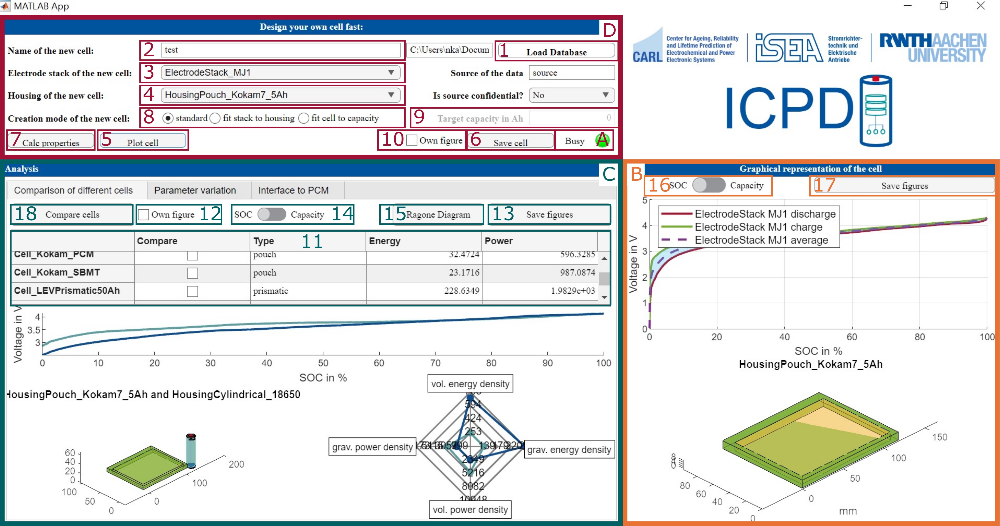
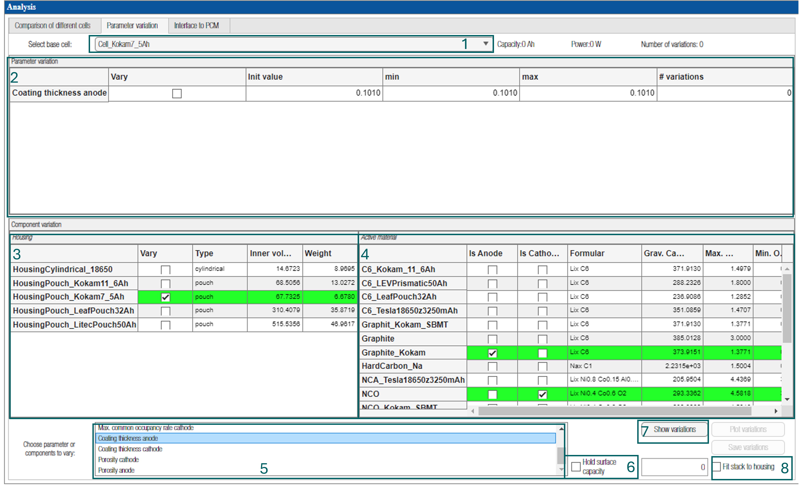
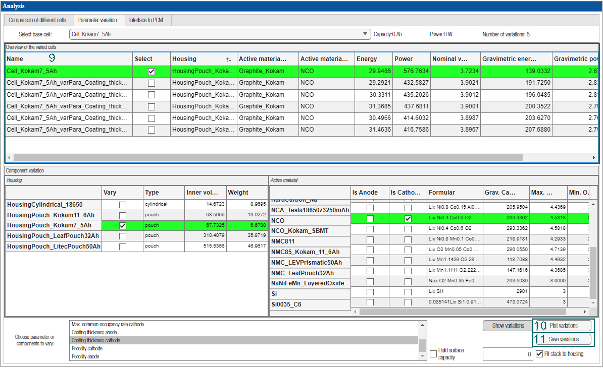
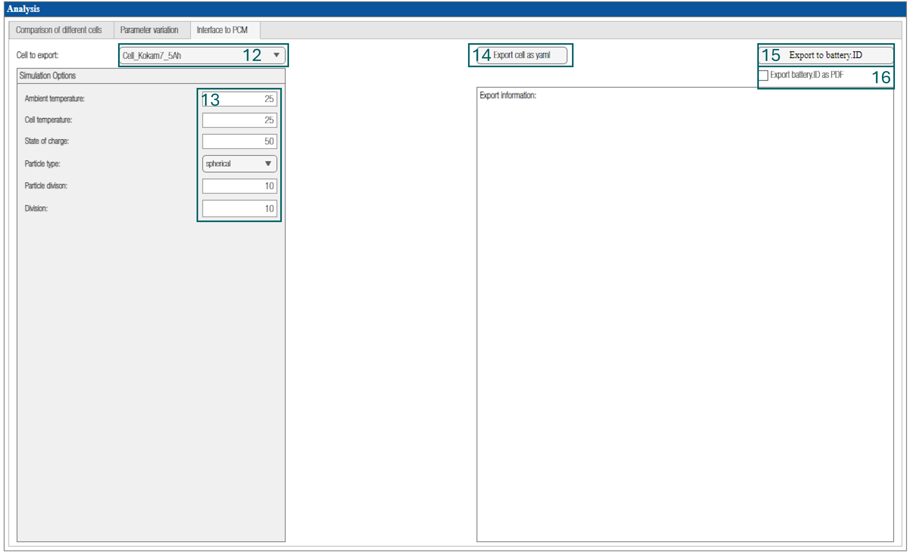

<pre>

</pre>

# ISEA Cell & Pack Database
The <a href=http://www.isea.rwth-aachen.de/>ISEA</a> Cell and Pack Database is a cell design model calculating cell performance parameters solely based on design parameters and material characteristics to bridge the gap between material and cell performance. It is a bottom-up database structure along the battery manufacturing process including most intermediate products. It can be applied for both storage of cell characterisation data of existing battery cells and virtually cell design for any cell chemistry.
The GUI was developed to provide the possibility of database based creation of battery cells with varying parameters. At the same time, the implemented interface to a PCM provides comprehensive analysis and simulation options for objects in the connected database.

|           |               Version 1.0					|
| :--- 		|       :---:       						|
|`Author`   | Nicolas Kaiser   							|
|`Email`    | mailto:Nicolas.Kaiser@isea.rwth-aachen.de |
|`Date`		| 26.03.2024								|
|`Date ICPD`| 28.11.2022								|

## Issue handling:
Please submit all bugs and suggestions as an issue in the GIT with detailed explanation and labelling (https://git.rwth-aachen.de/isea/isea-cell-and-pack-database/-/issues).

## Required Software:

+ MATLAB
+ Fitting algorithm easyFit published by Jean-Luc Dellis (https://de.mathworks.com/matlabcentral/fileexchange/10625-easyfit-x-y-varargin)

## Featured Projects

1. SimBAS - Simulation von Batteriezellen und Anwendungen in Speichersystemen, Simulation of battery cells and applications in storage systems
  * Grant No. 03XP0338B

2. greenBattNutzung  - Begleitprojekt Batterielebenszyklus, Supporting project battery life cycle
  * Grant No. 03XP0303C

## Authors
Please acknowledge the [authors](src/Documentation/DevelopmentTeam.md).

## License
The ISEA Cell and Pack Database is published under the BSD 3-Clause License.
Further information can be requested at batteries@isea.rwth-aachen.de.

## Further Reading

1. Paper describing the functions of the tool https://doi.org/10.1016/j.est.2023.108396

## ICPDGUI - Main tab and first step:
The first step is to wait until the control lamp **(A) isn't red** anymore!
The second step to use the tool is to load the database. The main tab is structured into several panels **(B,C,D)**. Pressing the 'Load Database' button **(1)** opens a dialog for selecting the database folder. In older versions of ICPD, a sample database can be found in the Databases folder.
The indicator lamps in panel **A** can be used to check whether all-important objects have been loaded after the loading process has been completed. 

Panel **D** can be used to quickly design cells by specifying the name **(2)**, electrode stack **(3)**, housing **(4)**, and creation mode **(8)**. The 'Save Cell' button **(6)** creates a new cell object based on the information specified in the panel and saves it to the database. By pressing button 'plot cell' **(5)** the generated cell will be plotted in the axes in panel **B**. Via the 'Save figures' button **(17)** the plots
can be saved. The radio buttons **(8)** can be used to change the creation mode of the cell. The standard mode isn't changing the dimensions or any other parameter of the electrode stack neither the housing. Therefor, it can be possible, that the electrode stack isn't fitting inside the housing. To prevent this the creation mode fit stack to housing can be used. The dimensions of the electrode stack gets
changed so the stack is fitting into the housing. Creation mode fit cell to capacity tries to adjust the dimensions and the stoichiometric factors so that the target capacity **(9)** can be reached. 
Marking checkbox **(10)** and pushing button **(5)** leads to an ploting in external figures. By pressing button 'Calc properties' **(7)** also the properties of the newly designed cell get listed in panel **B**.

The main tab also enables to compare different cells of the database. In table **(11)** multiple cells can be selected via the checkboxes in column 'Compare'. With the button 'Compare cells' **(12)** the selected cells are compared. The plots of the comparison will be created in new figures if the checkbox 'Own figure' next to the button **(12)** is marked. The cells can then be compared using the
three axes below the **(11)** table. This is done by comparing the OCVs and the housings of the cells and creating a spider diagram based on six common comparison parameters for batteries. With the button 'Save figures' **(13)** the plots can be saved. With the switches **(14)** and **(15)** the x-axes of the corresponding plots can be changed from SOC to capacity.

## ICPDGUI - Parameter Variation:
Starting the parameter variation, at first the base battery has to be chosen **(1)**. For variation certain options are available. On the one hand components can be exchanged with others, like housing **(3)** or anode/cathode active material **(4)**. By ticking the check boxes, the user can determine which variations shall be done. On the other hand, specific cell internal parameters, like coating thickness or porosity can be varied. Therefore, it is possible to choose the corresponding parameter in the list **(5)**. After this choice, in the parameter variation table **(2)** the cell shows up and the user can specify the limits a parameter can be vyried in **(min, max values)**. The initial value comes from the base cell. If the user wants to hold the surface capacity of the electrodes, the check box can be ticked **(6)**. Analogue to the creation of new cells the variation creation can be conducted in 3 different creation modes. Default is the standard mode, if the user wants to have the "fit stack to housing mode" is has to be ticked here **(8)**. Finally, all settings are done and the variations can be created by clicking the button **(7)**.

After creating all the variations, all cells with their corresponding parameter values are shown in the "Overview of the varied cells" table **(9)**. The variations can be analysed visually by creating several plots **(10)** and can be saved by clicking the corresponding button **(11)**.

## ICPDGUI - Export:

The interface to other battery tools is one crucial aspect for the ICPD. On interface is the export to use the data of a cell for physico-chemical battery simulation parameterising a DFN-model. The second implemented option is the export to an data exchange format called "battery.ID" which was used in the project SimBAS to share the parameters and use it in the SimSES tool (TUM; https://gitlab.lrz.de/open-ees-ses/simses) and the BaSD tool (FhG IISB; https://github.com/foxBMS/BaSD). In the first step the cell, which has to be exported shall be chosen **(12)**. The ISEAFrame (RWTH ISEA; https://git.rwth-aachen.de/isea/framework) can use the battery's parameters for electrical simulation. For the PCM export simulation parameters have to be set **(13)** and subsequently the export button **(14)** has to be clicked. To export the ICPD cell to the battery.ID, the corresponding button has to be clicked **(15)** and the xml is created and saved in the "export/batteryID" folder. There is a visualisation of the results in terms of a pdf document, that can be generated along with xml by ticking the check box **(16)**.

 Please see the documentation for [physico-chemical model export](src/Documentation/documentation.md). 

